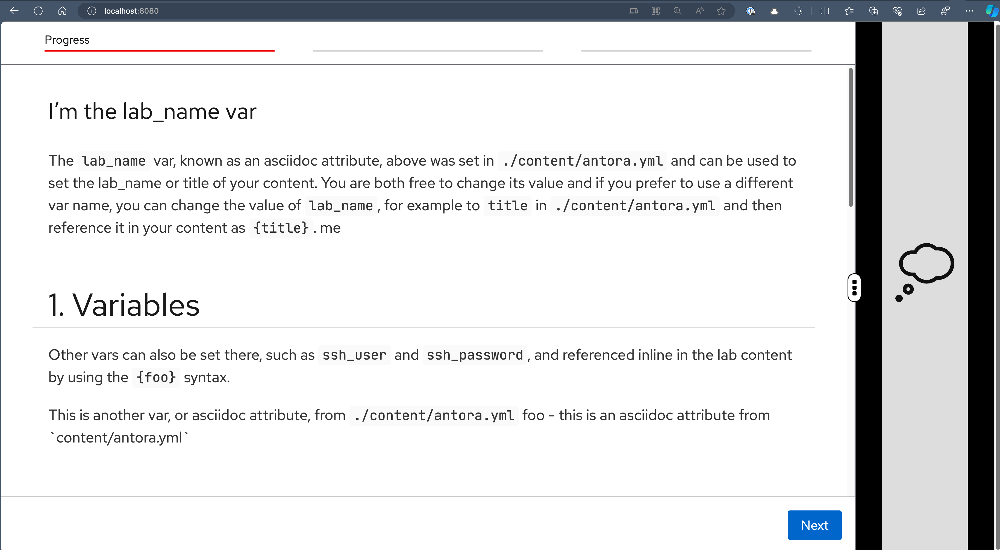

=== Getting Started

* Create a git repo from this template
* Clone the repo and *cd* into it
* Run the following command to build your html
[.copyable]
----
./utilities/lab-build
----
* Run the following command to serve the html
[.copyable]
----
./utilities/lab-serve
----
* Open *http://localhost:8080* in your browser

Your lab should now update and it will look more or less like this:

Now you are ready to go!  You can start editing the files in the `content/modules/ROOT/pages/` directory.

=== Understanding the Basic Template Directory Structure

. Content Directory
+
.tree output
[source,shell]
----
.
├── README.adoc                 # Readme file
├── runtime-automation          # Playbook/Scripts directory
├── zero-touch-config.yml       # Configuration file
├── zero-touch-site.yml     
└── content                     # Content directory
    ├── antora.yml              # Antora configuration file. You can add "inline vars" here to render within your content
    └── modules/ROOT
        ├── assets
        │   └── images                       # Images used in your content 
        │       └── example-image.png
        ├── pages                            # Your content goes here
        │   ├── index.adoc                   # First module of your lab, e.g. overview etc 
        │   ├── module-02.adoc               # Second module of your lab  
        │   └── module-03.adoc               # Third module
----

. Playbook/Scripts Directory Structure
+
.tree output
[source,shell]
----
runtime-automation/
├── module_1                            # The directory name should be the same as 
│                                       # the module content page name
│   ├── setup.yml                       # Setup playbook which run at start of module 
│                                       # and when clicked on next button
│   ├── solve.yml                       # Solve playbook, run when clicked on solve button
│   └── validation.yml                  # Validation playbook, run when click on next button
├── ansible.cfg                         # Ansible configuration used with module playbooks
└── inventory                           # Inventory for the playbook
----

== Understanding Zero Touch Configration file
. Example: The *zero-touch-config.yml* configuration file
+
.tree output
[source,shell]
----
antora:
  name: modules
  dir: www
  modules:
    - name: 01-playbook-inventory               # Module Name
      label: Playbook Inventory                 # Module Label
      solveButton: true                         # Enable Solve button
    - name: 02-playbook-directory-structure
      label: Playbook Directory Structure
      solveButton: true
tabs:
  - name: VSCode Editor                         # Tab name
    port: 8443                                  # Port no of the service
    path: /?folder=/home/rhel/ansible-files/    # Path suffix
  - name: ">_control"                           # Tab name
    port: 443                                   # Port of the tt1 terminal
    path: /tty1                                 # Path to the tty1 terminal
----

=== Development Cycle

. Edit your content in `content/modules/ROOT/pages/`
. Run `./utilities/build` to build your html
. Use `git` to branch and commit your work
. Push your work to your repo
.. You should use `git tags` or `git branches` in production
.. However development items default to the head of `main`

